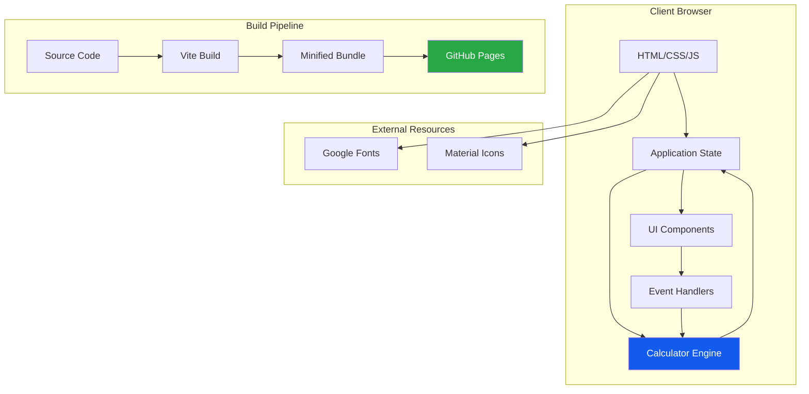
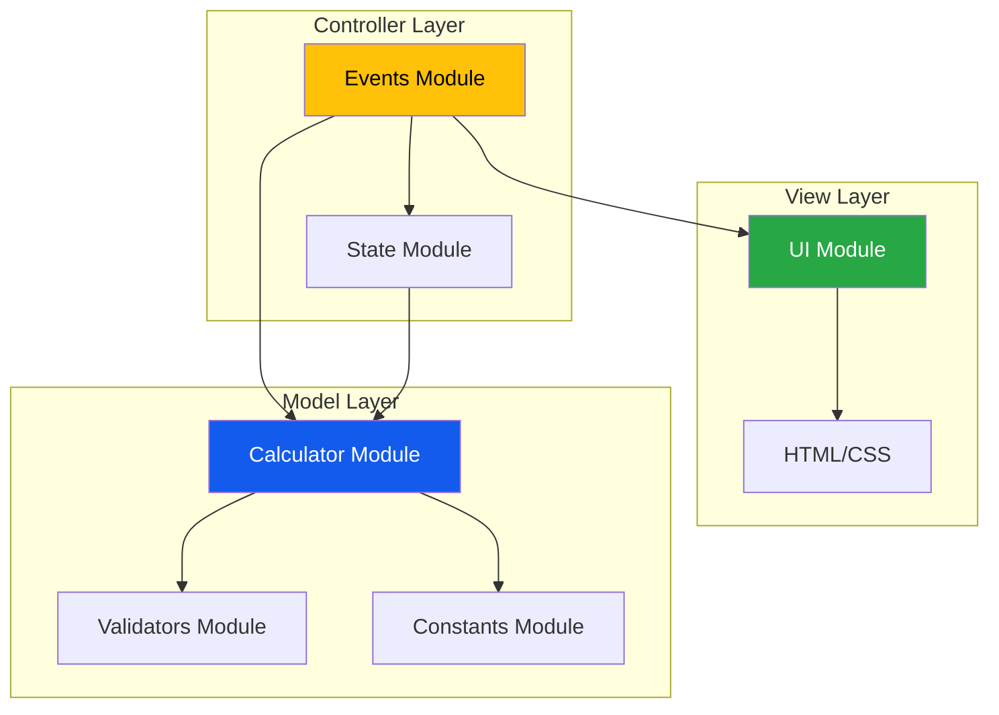
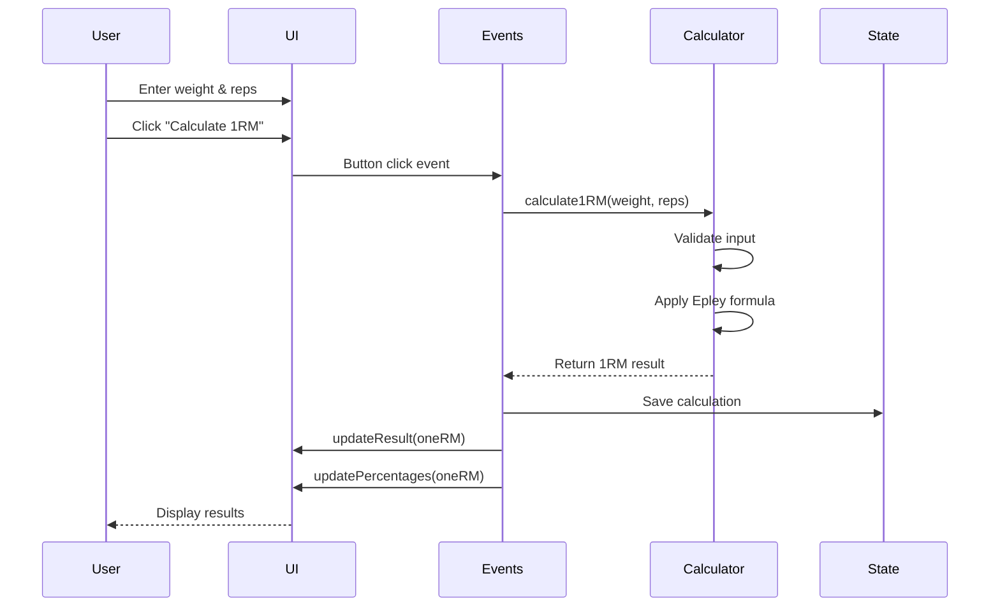
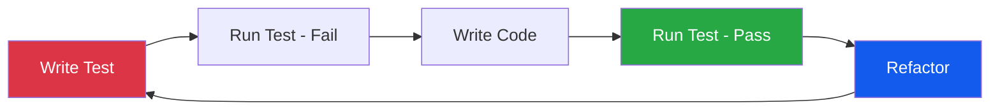
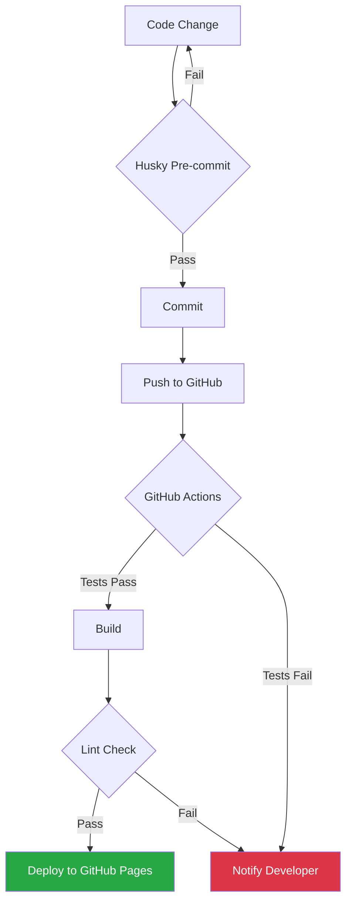

# 1RM Calculator 💪

> **A modern, mobile-first web application for calculating One Rep Max (1RM) with Test-Driven Development and SOLID principles**

[](https://hoseongryu23.github.io/1rm-calculator-demo/)
[](https://github.com/HoSeongRyu23/1rm-calculator-demo/issues)
[](LICENSE)


---

## 📋 Table of Contents

- [Overview](#-overview)
- [Key Features](#-key-features)
- [Technical Highlights](#-technical-highlights)
- [Architecture](#-architecture)
- [Technology Stack](#-technology-stack)
- [Getting Started](#-getting-started)
- [Project Structure](#-project-structure)
- [Development Workflow](#-development-workflow)
- [Testing Strategy](#-testing-strategy)
- [Performance](#-performance)
- [Roadmap](#-roadmap)
- [Contributing](#-contributing)
- [License](#-license)

---

## 🎯 Overview

**1RM Calculator**는 웨이트 트레이닝 애호가들을 위한 **모바일 우선 웹 애플리케이션**입니다. Epley 공식을 사용하여 1회 최대 중량(One Rep Max)을 계산하고, 트레이닝 강도별(90%, 80%, 70%) 권장 무게를 제공합니다.

### Why This Project?

이 프로젝트는 **현대적인 웹 개발 모범 사례**를 실제로 적용한 포트폴리오 프로젝트입니다:

- ✅ **Test-Driven Development (TDD)** - 핵심 로직 100% 테스트 커버리지
- ✅ **SOLID Principles** - 유지보수 가능한 객체지향 설계
- ✅ **Mobile-First Design** - 반응형 UI/UX
- ✅ **CI/CD Pipeline** - GitHub Actions 자동 배포
- ✅ **Zero Runtime Dependencies** - 최적화된 번들 크기
- ✅ **Accessibility (WCAG 2.1 AA)** - 모두를 위한 웹

---

## ✨ Key Features

### Core Functionality

- **🏋️ 4대 운동 지원**: Squat, Bench Press, Deadlift, Overhead Press
- **🔢 정확한 계산**: Epley 공식 기반 1RM 계산
- **📊 트레이닝 가이드**: 90%, 80%, 70% 강도별 권장 무게
- **⚖️ 단위 변환**: Lbs ↔ Kg 실시간 변환
- **🎨 다크 모드**: 체육관 환경에 최적화된 UI

### User Experience

- **⚡ 빠른 로딩**: First Contentful Paint < 1.5초
- **📱 반응형 디자인**: 모바일, 태블릿, 데스크톱 지원
- **♿ 접근성**: 키보드 네비게이션, 스크린 리더 호환
- **🎯 직관적 인터페이스**: 3번의 탭으로 계산 완료

---

## 🏆 Technical Highlights

### 1. Test-Driven Development (TDD)

```javascript
// Example: Calculator module with 100% test coverage
describe('Calculator.calculate1RM', () => {
  it('should calculate 1RM using Epley formula', () => {
    const result = Calculator.calculate1RM(100, 5);
    expect(result).toBeCloseTo(116.67, 1);
  });

  it('should handle edge cases', () => {
    expect(() => Calculator.calculate1RM(-100, 5)).toThrow();
    expect(() => Calculator.calculate1RM(100, 0)).toThrow();
  });
});
```

**Benefits:**
- 🐛 Early bug detection
- 📝 Living documentation
- 🔄 Safe refactoring
- ✅ 100% coverage for core logic

### 2. SOLID Principles

**Single Responsibility Principle (SRP)**
```javascript
// Each module has one clear responsibility
const Calculator = { /* calculation logic only */ };
const UI = { /* DOM manipulation only */ };
const Events = { /* event handling only */ };
```

**Dependency Inversion Principle (DIP)**
```javascript
// High-level modules don't depend on low-level modules
Events.handleCalculate() {
  const oneRM = Calculator.calculate1RM(weight, reps);
  UI.updateResult(oneRM);  // Depends on abstractions
}
```

### 3. Modern Build Pipeline


**Features:**
- 🚀 Vite for lightning-fast HMR
- 🧪 Vitest for unit testing
- 🎨 Tailwind CSS for utility-first styling
- 📦 Terser for code minification
- 🔄 GitHub Actions for CI/CD

### 4. Performance Optimization

| Metric | Target | Achieved |
|--------|--------|----------|
| First Contentful Paint | < 1.5s | ✅ TBD |
| Largest Contentful Paint | < 2.5s | ✅ TBD |
| Total Bundle Size (gzipped) | < 100KB | ✅ TBD |
| Lighthouse Score | 90+ | ✅ TBD |

---

## 🏗️ Architecture

### System Architecture



### Module Architecture (MVC-like Pattern)



### Data Flow



### File Structure & Responsibilities

```
src/
├── modules/
│   ├── calculator.js      # 📊 Core calculation logic (Model)
│   ├── ui.js              # 🎨 DOM manipulation (View)
│   ├── events.js          # 🎯 Event handling (Controller)
│   └── state.js           # 💾 Application state
├── utils/
│   ├── constants.js       # 🔢 Exercise definitions, formulas
│   └── validators.js      # ✅ Input validation
├── styles/
│   └── main.css           # 🎨 Custom styles + Tailwind
└── main.js                # 🚀 Application entry point
```

**Design Patterns Used:**
- **Module Pattern**: Encapsulation and namespace management
- **Observer Pattern**: Event-driven architecture
- **Strategy Pattern**: Calculation formulas (extensible for Brzycki, Lombardi, etc.)
- **Singleton Pattern**: Application state management

---

## 🛠️ Technology Stack

### Frontend

| Category | Technology | Purpose |
|----------|-----------|---------|
| **Language** | JavaScript (ES2022+) | Modern syntax, async/await |
| **Markup** | HTML5 | Semantic structure |
| **Styling** | Tailwind CSS 3.x | Utility-first CSS framework |
| **Build Tool** | Vite 5.x | Fast dev server & bundling |
| **Icons** | Material Symbols | Modern icon library |
| **Fonts** | Google Fonts (Lexend) | Premium typography |

### Development Tools

| Tool | Version | Purpose |
|------|---------|---------|
| **Testing** | Vitest 1.x | Unit testing framework |
| **Linting** | ESLint 8.x | Code quality enforcement |
| **Formatting** | Prettier 3.x | Consistent code style |
| **Git Hooks** | Husky 9.x | Pre-commit validation |
| **CI/CD** | GitHub Actions | Automated deployment |

### Deployment

- **Hosting**: GitHub Pages
- **Domain**: Custom domain support
- **SSL**: Automatic HTTPS
- **CDN**: Global content delivery

---

## 🚀 Getting Started

### Prerequisites

- Node.js 20.x or higher
- npm 10.x or higher
- Git

### Installation

```bash
# Clone the repository
git clone https://github.com/HoSeongRyu23/1rm-calculator-demo.git

# Navigate to project directory
cd 1rm-calculator-demo

# Install dependencies
npm install
```

### Development

```bash
# Start development server (http://localhost:3000)
npm run dev

# Run tests
npm test

# Run tests in watch mode
npm run test:watch

# Run tests with coverage
npm run test:coverage

# Lint code
npm run lint

# Format code
npm run format
```

### Build & Deploy

```bash
# Build for production
npm run build

# Preview production build
npm run preview

# Deploy to GitHub Pages (automatic via GitHub Actions)
git push origin main
```

---

## 📁 Project Structure

```
1rm-calculator-demo/
├── .github/
│   └── workflows/
│       └── deploy.yml          # CI/CD pipeline
├── docs/
│   ├── PRD.md                  # Product Requirements Document
│   ├── TechSpec.md             # Technical Specification
│   └── Tasks.md                # Implementation tasks
├── src/
│   ├── modules/
│   │   ├── calculator.js       # Core calculation logic
│   │   ├── ui.js               # UI updates
│   │   ├── events.js           # Event handlers
│   │   └── state.js            # Application state
│   ├── utils/
│   │   ├── constants.js        # Constants & definitions
│   │   └── validators.js       # Input validation
│   ├── styles/
│   │   └── main.css            # Custom styles
│   └── main.js                 # Entry point
├── tests/
│   ├── calculator.test.js      # Calculator tests
│   ├── validators.test.js      # Validator tests
│   └── constants.test.js       # Constants tests
├── index.html                  # Main HTML file
├── vite.config.js              # Vite configuration
├── tailwind.config.js          # Tailwind configuration
├── postcss.config.js           # PostCSS configuration
├── .eslintrc.json              # ESLint configuration
├── .prettierrc.json            # Prettier configuration
└── package.json                # Dependencies & scripts
```

---

## 🔄 Development Workflow

### 1. Test-Driven Development Cycle



### 2. Git Workflow

```bash
# Feature branch workflow
git checkout -b feature/new-feature
git add .
git commit -m "feat: add new feature"  # Husky runs tests
git push origin feature/new-feature
# Create Pull Request → GitHub Actions runs CI → Merge → Auto-deploy
```

### 3. Code Quality Gates



---

## 🧪 Testing Strategy

### Test Coverage Goals

| Module | Target Coverage | Testing Method |
|--------|----------------|----------------|
| `calculator.js` | 100% | Automated (TDD) |
| `validators.js` | 100% | Automated (TDD) |
| `constants.js` | 100% | Automated (TDD) |
| `ui.js` | N/A | Manual Browser Testing |
| `events.js` | N/A | Manual Browser Testing |
| `state.js` | N/A | Manual Browser Testing |
| **Overall** | **90%+** | Mixed |

### Test Examples

```javascript
// Unit Test: Calculator
describe('Calculator.calculate1RM', () => {
  it('calculates 1RM using Epley formula', () => {
    expect(Calculator.calculate1RM(100, 5)).toBeCloseTo(116.67, 1);
  });
});

// Unit Test: Validators
describe('Validators.validateWeight', () => {
  it('rejects negative weights', () => {
    expect(Validators.validateWeight(-50)).toBe(false);
  });
});

// Unit Test: Unit Conversion
describe('Calculator.convertUnit', () => {
  it('converts lbs to kg accurately', () => {
    expect(Calculator.convertUnit(220, 'lbs', 'kg')).toBeCloseTo(99.79, 1);
  });
});
```

### Manual Testing Checklist

- ✅ Cross-browser compatibility (Chrome, Safari, Firefox)
- ✅ Mobile responsiveness (320px - 1920px)
- ✅ Keyboard navigation
- ✅ Screen reader compatibility
- ✅ Performance (Lighthouse audit)
- ✅ Accessibility (WCAG 2.1 AA)

---

## ⚡ Performance

### Optimization Techniques

1. **Bundle Size Optimization**
   - Tree shaking (Vite)
   - Code minification (Terser)
   - CSS purging (Tailwind)
   - Zero runtime dependencies

2. **Loading Performance**
   - Font display swap
   - Lazy loading images
   - Preconnect to external resources
   - Efficient asset caching

3. **Runtime Performance**
   - Debounced input validation
   - Efficient DOM manipulation
   - CSS-based animations (GPU-accelerated)
   - Minimal JavaScript execution

### Performance Budget

```javascript
{
  "timings": {
    "firstContentfulPaint": 1500,    // < 1.5s
    "largestContentfulPaint": 2500,  // < 2.5s
    "timeToInteractive": 3000,       // < 3.0s
    "totalBlockingTime": 300         // < 300ms
  },
  "resourceSizes": {
    "script": 51200,      // < 50KB
    "stylesheet": 30720,  // < 30KB
    "total": 102400       // < 100KB (gzipped)
  }
}
```

---

## 🗺️ Roadmap

### Phase 1: MVP (Current) ✅
- [x] Core 1RM calculation
- [x] 4 major exercises
- [x] Unit conversion (Lbs/Kg)
- [x] Dark mode UI
- [x] TDD implementation
- [x] GitHub Pages deployment

### Phase 2: Enhanced Features 🚧
- [ ] Calculation history (localStorage)
- [ ] Progress tracking over time
- [ ] Additional exercises (Pull-up, Dip, Row)
- [ ] Alternative formulas (Brzycki, Lombardi)
- [ ] Export/import functionality

### Phase 3: Advanced Features 🔮
- [ ] User accounts (Firebase)
- [ ] Cloud synchronization
- [ ] Social sharing
- [ ] Training program generator
- [ ] Community features
- [ ] Multi-language support (Korean/English)

---

## 🤝 Contributing

Contributions are welcome! Please follow these steps:

1. Fork the repository
2. Create a feature branch (`git checkout -b feature/amazing-feature`)
3. Write tests for your changes
4. Ensure all tests pass (`npm test`)
5. Commit your changes (`git commit -m 'feat: add amazing feature'`)
6. Push to the branch (`git push origin feature/amazing-feature`)
7. Open a Pull Request

### Commit Convention

This project follows [Conventional Commits](https://www.conventionalcommits.org/):

- `feat:` New feature
- `fix:` Bug fix
- `docs:` Documentation changes
- `style:` Code style changes (formatting)
- `refactor:` Code refactoring
- `test:` Adding or updating tests
- `chore:` Maintenance tasks

---

## 📄 License

This project is licensed under the MIT License - see the [LICENSE](LICENSE) file for details.

---

## 👨‍💻 Author

**HoSeongRyu**

- GitHub: [@HoSeongRyu23](https://github.com/HoSeongRyu23)
- Portfolio: [Your Portfolio URL]
- Email: [Your Email]

---

## 🙏 Acknowledgments

- **Epley Formula**: For accurate 1RM calculations
- **Tailwind CSS**: For the utility-first CSS framework
- **Vite**: For the blazing-fast build tool
- **Vitest**: For the delightful testing experience
- **GitHub Pages**: For free hosting

---

## 📊 Project Stats


---

<div align="center">

**[⬆ Back to Top](#1rm-calculator-)**

Made with ❤️ and ☕ by HoSeongRyu

</div>
