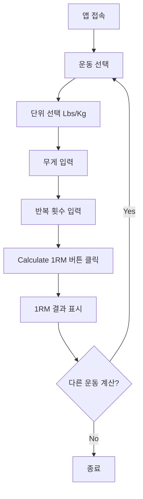

# Product Requirements Document: 1RM Calculator

## 1. Overview

### 1.1 Product Summary
1RM Calculator는 웨이트 트레이닝을 하는 사용자들이 자신의 1회 최대 중량(One Rep Max)을 쉽게 계산할 수 있도록 돕는 모바일 우선 웹 애플리케이션입니다. 사용자는 특정 운동에서 들어올린 무게와 반복 횟수를 입력하여 예상 1RM을 계산하고, 트레이닝 강도별 권장 무게를 확인할 수 있습니다.

### 1.2 Target Users
- **초급 ~ 중급 웨이트 트레이닝 애호가**: 자신의 진행 상황을 추적하고 싶은 사용자
- **피트니스 코치 및 트레이너**: 클라이언트의 트레이닝 프로그램을 설계하는 전문가
- **파워리프팅/보디빌딩 선수**: 정확한 트레이닝 로드를 계산해야 하는 운동선수

### 1.3 Core Value Proposition
- **빠르고 직관적인 계산**: 복잡한 공식 없이 즉시 1RM 계산
- **다크 모드 우선 디자인**: 체육관 환경에 최적화된 시각적 편안함
- **4대 운동 지원**: Squat, Bench Press, Deadlift, Overhead Press
- **트레이닝 가이드**: 90%, 80%, 70% 강도별 권장 무게 제공

---

## 2. Product Goals & Success Metrics

### 2.1 Product Goals
1. **사용성**: 3번의 탭/입력 이내로 1RM 계산 완료
2. **정확성**: 업계 표준 Epley 공식 기반 계산
3. **접근성**: 모바일, 태블릿, 데스크톱 모든 환경에서 원활한 사용
4. **시각적 우수성**: 프리미엄 피트니스 앱 수준의 UI/UX

### 2.2 Success Metrics
- **사용자 참여도**: 평균 세션당 3회 이상 계산 수행
- **재방문율**: 주간 재방문율 40% 이상
- **계산 완료율**: 입력 시작 후 계산 완료율 95% 이상
- **로딩 성능**: First Contentful Paint < 1.5초

---

## 3. Functional Requirements

### 3.1 Exercise Selection
**Priority**: P0 (Must Have)

#### Description
사용자는 4가지 주요 운동 중 하나를 선택할 수 있습니다.

#### Specifications
- **지원 운동**:
  - Squat (스쿼트) - Primary Muscle: Legs & Core
  - Bench Press (벤치 프레스) - Primary Muscle: Chest & Triceps
  - Deadlift (데드리프트) - Primary Muscle: Back & Legs
  - Overhead Press (오버헤드 프레스) - Primary Muscle: Shoulders

- **UI 동작**:
  - 라디오 버튼 기반 단일 선택
  - 선택된 운동은 파란색(#135bec) 배경으로 하이라이트
  - 선택 시 부드러운 페이드인 애니메이션(0.3초)
  - 각 운동별 대표 이미지 카드 표시
  - 이미지 카드에 Primary Muscle 정보 오버레이

#### User Stories
```
AS A 웨이트 트레이닝 사용자
I WANT TO 운동 종류를 선택할 수 있기를
SO THAT 각 운동에 맞는 1RM을 계산할 수 있다
```

#### Acceptance Criteria
- [ ] 4가지 운동 버튼이 수평 스크롤 가능한 형태로 표시됨
- [ ] 선택된 운동은 시각적으로 명확하게 구분됨
- [ ] 운동 선택 시 해당 운동의 이미지 카드가 표시됨
- [ ] 모바일에서 터치 제스처로 원활하게 선택 가능

---

### 3.2 Unit Selection (Lbs/Kg)
**Priority**: P0 (Must Have)

#### Description
사용자는 무게 단위를 파운드(Lbs) 또는 킬로그램(Kg)으로 선택할 수 있습니다.

#### Specifications
- **기본값**: Lbs (파운드)
- **UI 컴포넌트**: 토글 스위치 형태의 세그먼트 컨트롤
- **위치**: 헤더 하단, 앱 상단에 고정
- **동작**:
  - 단위 변경 시 입력값 자동 변환
  - 계산 결과도 선택된 단위로 표시
  - 부드러운 전환 애니메이션

#### User Stories
```
AS A 국제 사용자
I WANT TO 무게 단위를 선택할 수 있기를
SO THAT 내가 익숙한 단위로 계산할 수 있다
```

#### Acceptance Criteria
- [ ] Lbs/Kg 토글 스위치가 헤더에 표시됨
- [ ] 기본값은 Lbs로 설정됨
- [ ] 단위 변경 시 입력값이 자동 변환됨 (1 kg = 2.20462 lbs)
- [ ] 계산 결과가 선택된 단위로 표시됨

---

### 3.3 Weight & Reps Input
**Priority**: P0 (Must Have)

#### Description
사용자는 들어올린 무게(Weight)와 반복 횟수(Reps)를 입력합니다.

#### Specifications
- **입력 필드**:
  - **Weight**: 숫자 입력, 소수점 허용
  - **Reps**: 정수 입력, 1-20 범위 권장
  
- **UI 디자인**:
  - 2개 입력 필드가 가로로 나란히 배치
  - 다크 배경(#282e39)의 큰 입력 박스
  - 플레이스홀더: "0"
  - 텍스트 중앙 정렬, 큰 폰트(2xl, bold)
  - Weight 필드 우측에 현재 단위 표시 (LBS/KG)

- **유효성 검사**:
  - Weight: 0보다 큰 숫자
  - Reps: 1-50 사이의 정수
  - 잘못된 입력 시 빨간색 테두리 표시

#### User Stories
```
AS A 사용자
I WANT TO 무게와 반복 횟수를 입력할 수 있기를
SO THAT 내 1RM을 계산할 수 있다
```

#### Acceptance Criteria
- [ ] Weight와 Reps 입력 필드가 명확하게 표시됨
- [ ] 숫자 키패드가 모바일에서 자동으로 나타남
- [ ] 유효하지 않은 입력 시 시각적 피드백 제공
- [ ] 입력 중 실시간으로 포커스 상태 표시

---

### 3.4 1RM Calculation
**Priority**: P0 (Must Have)

#### Description
사용자가 "Calculate 1RM" 버튼을 클릭하면 Epley 공식을 사용하여 1RM을 계산합니다.

#### Specifications
- **계산 공식**: Epley Formula
  ```
  1RM = Weight × (1 + Reps / 30)
  ```

- **추가 계산**:
  - 90% 1RM (근력 트레이닝)
  - 80% 1RM (근비대 트레이닝)
  - 70% 1RM (근지구력 트레이닝)

- **결과 표시**:
  - 1RM: 큰 숫자(5xl, 굵은 글씨), 파란색(#135bec)
  - 90%, 80%, 70% 값: 3열 그리드로 표시
  - 모든 값은 소수점 첫째 자리까지 표시

- **버튼 디자인**:
  - 하단 고정 위치
  - 전체 너비, 높이 14 (56px)
  - 파란색 배경(#135bec), 호버 시 진한 파란색(#0f4bc2)
  - "calculate" 아이콘 + "Calculate 1RM" 텍스트
  - 클릭 시 scale 애니메이션(0.98)

#### User Stories
```
AS A 사용자
I WANT TO 1RM을 계산할 수 있기를
SO THAT 내 최대 중량을 알고 트레이닝 계획을 세울 수 있다
```

#### Acceptance Criteria
- [ ] "Calculate 1RM" 버튼이 화면 하단에 고정됨
- [ ] Weight와 Reps가 모두 입력되어야 계산 가능
- [ ] 계산 결과가 즉시 표시됨
- [ ] 90%, 80%, 70% 값이 정확하게 계산됨
- [ ] 버튼 클릭 시 시각적 피드백 제공

---

### 3.5 Settings (Future Enhancement)
**Priority**: P2 (Nice to Have)

#### Description
사용자 설정 기능 (향후 구현 예정)

#### Potential Features
- 계산 공식 선택 (Epley, Brzycki, Lombardi 등)
- 기록 저장 및 히스토리
- 다크/라이트 모드 토글
- 언어 설정 (한국어/영어)

---

## 4. Non-Functional Requirements

### 4.1 Performance
- **로딩 시간**: First Contentful Paint < 1.5초
- **계산 응답 시간**: < 100ms
- **애니메이션**: 60fps 유지
- **번들 크기**: < 100KB (gzipped)

### 4.2 Compatibility
- **브라우저**:
  - Chrome 90+
  - Safari 14+
  - Firefox 88+
  - Edge 90+
- **디바이스**:
  - 모바일: 320px ~ 480px
  - 태블릿: 481px ~ 1024px
  - 데스크톱: 1025px+

### 4.3 Accessibility
- **WCAG 2.1 Level AA** 준수
- 키보드 네비게이션 지원
- 스크린 리더 호환성
- 색상 대비율 4.5:1 이상

### 4.4 Security
- 클라이언트 사이드 계산 (서버 통신 불필요)
- XSS 방지를 위한 입력 sanitization
- HTTPS 필수

---

## 5. Design Specifications

### 5.1 Color Palette
```css
/* Primary Colors */
--primary: #135bec
--primary-dark: #0f4bc2

/* Background Colors */
--background-light: #f6f6f8
--background-dark: #101622
--card-dark: #1c222e
--input-dark: #282e39

/* Text Colors */
--text-primary-dark: #ffffff
--text-secondary: #9da6b9
```

### 5.2 Typography
- **Font Family**: Lexend (Google Fonts)
- **Font Weights**: 300, 400, 500, 600, 700
- **Heading (h1)**: 1.25rem (20px), bold
- **Input Text**: 1.5rem (24px), bold
- **1RM Result**: 3rem (48px), black (900)

### 5.3 Spacing & Layout
- **Container Padding**: 1rem (16px)
- **Card Padding**: 1.5rem (24px)
- **Border Radius**: 
  - Default: 0.25rem
  - Large: 0.5rem
  - XL: 0.75rem
  - Full: 9999px (pills)

### 5.4 Components

#### Header
- Sticky positioning
- Backdrop blur effect
- Title + Settings button
- Unit toggle (Lbs/Kg)

#### Exercise Selector
- Horizontal scrollable pills
- Active state: primary color background
- Smooth transitions
- Box shadow on active state

#### Exercise Card
- 192px height (h-48)
- Background image with gradient overlay
- Hover scale effect (1.05)
- Primary muscle badge

#### Input Card
- White/dark card background
- Two-column layout (Weight | Reps)
- Large input fields with focus states
- Unit indicator

#### Result Display
- Gradient background (primary/10 to transparent)
- Large 1RM number
- 3-column grid for percentages
- Dividers between columns

#### Calculate Button
- Fixed bottom position
- Full width with padding
- Icon + text
- Active state animation

---

## 6. Technical Stack

### 6.1 Frontend
- **Framework**: Vanilla HTML/CSS/JavaScript (또는 React/Vue 선택 가능)
- **CSS Framework**: Tailwind CSS 3.x
- **Icons**: Material Symbols Outlined
- **Fonts**: Google Fonts (Lexend)

### 6.2 Build Tools
- **Bundler**: Vite 또는 Webpack
- **CSS Processing**: PostCSS, Autoprefixer
- **Minification**: Terser (JS), cssnano (CSS)

### 6.3 Deployment
- **Hosting**: GitHub Pages, Vercel, 또는 Netlify
- **CI/CD**: GitHub Actions
- **Domain**: Custom domain 지원

---

## 7. User Flow

### 7.1 Primary Flow


### 7.2 Edge Cases
- **빈 입력**: 버튼 비활성화 또는 경고 메시지
- **0 또는 음수 입력**: 유효성 검사 실패 표시
- **너무 큰 Reps (>50)**: 경고 메시지 (공식 정확도 저하)
- **단위 변경 중 입력값 존재**: 자동 변환

---

## 8. Future Enhancements

### Phase 2 Features
- [ ] **운동 기록 저장**: LocalStorage 또는 Firebase 활용
- [ ] **진행 상황 추적**: 시간별 1RM 변화 그래프
- [ ] **추가 운동 지원**: Pull-up, Dip, Row 등
- [ ] **공식 선택**: Epley, Brzycki, Lombardi, Mayhew 등
- [ ] **소셜 공유**: 결과를 SNS에 공유

### Phase 3 Features
- [ ] **사용자 계정**: 로그인 및 클라우드 동기화
- [ ] **트레이닝 프로그램 생성**: 1RM 기반 자동 프로그램 생성
- [ ] **커뮤니티 기능**: 리더보드, 챌린지
- [ ] **다국어 지원**: 한국어, 영어, 일본어 등

---

## 9. Risks & Mitigations

| Risk | Impact | Probability | Mitigation |
|------|--------|-------------|------------|
| 계산 공식 정확도 논란 | Medium | Low | 여러 공식 옵션 제공, 면책 조항 추가 |
| 모바일 성능 이슈 | High | Low | 번들 크기 최적화, 레이지 로딩 |
| 브라우저 호환성 문제 | Medium | Medium | Polyfill 사용, 브라우저 테스트 자동화 |
| 사용자 데이터 손실 | Low | Medium | LocalStorage 백업, 내보내기 기능 |

---

## 10. Success Criteria & Launch Checklist

### Pre-Launch Checklist
- [ ] 모든 P0 기능 구현 완료
- [ ] 4개 주요 브라우저에서 테스트 완료
- [ ] 모바일/태블릿/데스크톱 반응형 확인
- [ ] 접근성 테스트 (WCAG AA)
- [ ] 성능 테스트 (Lighthouse 90+ 점수)
- [ ] 사용자 테스트 5명 이상 완료
- [ ] 문서화 완료 (README, 사용 가이드)

### Post-Launch Monitoring
- Google Analytics 설정
- 에러 트래킹 (Sentry 등)
- 사용자 피드백 수집 채널
- 주간 성능 모니터링

---

## 11. Appendix

### A. 1RM 계산 공식 비교

| Formula | Equation | Best For |
|---------|----------|----------|
| Epley | 1RM = w × (1 + r/30) | 일반적인 사용, 간단함 |
| Brzycki | 1RM = w × (36 / (37 - r)) | 낮은 반복 횟수 (1-10) |
| Lombardi | 1RM = w × r^0.10 | 높은 반복 횟수 |
| Mayhew | 1RM = (100 × w) / (52.2 + 41.9 × e^(-0.055 × r)) | 벤치 프레스 특화 |

**선택 이유**: Epley 공식은 가장 널리 사용되며, 계산이 간단하고 1-10 reps 범위에서 정확도가 높습니다.

### B. Design Reference
디자인 참고 파일: [code.html](file:///c:/Users/ab/workspace/1rm-calculator-demo/design_reference/code.html)

### C. Glossary
- **1RM (One Rep Max)**: 한 번에 들어올릴 수 있는 최대 중량
- **Reps**: 반복 횟수 (Repetitions)
- **Lbs**: 파운드 (Pounds)
- **Kg**: 킬로그램 (Kilograms)
- **PR (Personal Record)**: 개인 최고 기록
