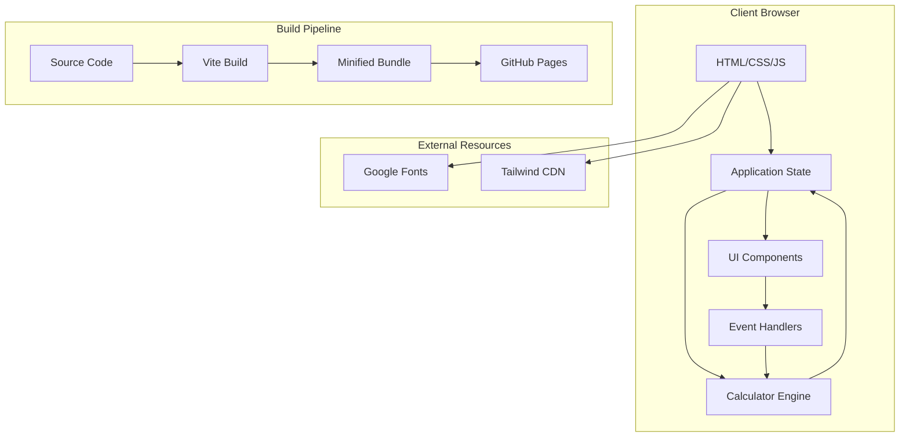

# Technical Specification: 1RM Calculator

## Document Information
- **Version**: 1.0
- **Last Updated**: 2025-12-24
- **Author**: Development Team
- **Status**: Draft

---

## 1. Executive Summary

본 문서는 1RM Calculator 웹 애플리케이션의 기술적 구현 세부사항을 정의합니다. 이 애플리케이션은 모바일 우선(Mobile-First) 접근 방식으로 설계되며, 빠른 로딩 속도와 직관적인 사용자 경험을 제공하는 것을 목표로 합니다.

### Key Technical Decisions
- **Framework**: Vanilla JavaScript (프레임워크 없음)
- **Styling**: Tailwind CSS 3.x
- **Build Tool**: Vite
- **Deployment**: GitHub Pages
- **Testing**: Vitest (core logic only, UI tested manually)

---

## 2. Architecture Overview

### 2.1 System Architecture



### 2.2 Application Architecture Pattern

**Pattern**: MVC-like Structure (without framework)

```
src/
├── index.html          # Entry point
├── main.js             # Application initialization
├── styles/
│   └── main.css        # Custom styles + Tailwind
├── modules/
│   ├── calculator.js   # Calculator logic (Model)
│   ├── ui.js           # UI updates (View)
│   └── events.js       # Event handlers (Controller)
└── utils/
    ├── constants.js    # Constants (formulas, exercises)
    └── validators.js   # Input validation
```

---

## 3. Technology Stack

### 3.1 Core Technologies

| Category | Technology | Version | Purpose |
|----------|-----------|---------|---------|
| **Language** | JavaScript | ES2022+ | Application logic |
| **Markup** | HTML5 | - | Structure |
| **Styling** | CSS3 | - | Custom styles |
| **CSS Framework** | Tailwind CSS | 3.4+ | Utility-first styling |
| **Build Tool** | Vite | 5.x | Dev server & bundling |
| **Package Manager** | npm | 10.x | Dependency management |

### 3.2 Development Tools

| Tool | Version | Purpose |
|------|---------|---------|
| **Testing Framework** | Vitest | 1.x | Unit testing (core logic only) |
| **Linter** | ESLint | 8.x | Code quality |
| **Formatter** | Prettier | 3.x | Code formatting |
| **Git Hooks** | Husky | 9.x | Pre-commit hooks |

### 3.3 External Dependencies

```json
{
  "dependencies": {},
  "devDependencies": {
    "vite": "^5.0.0",
    "vitest": "^1.0.0",
    "eslint": "^8.55.0",
    "prettier": "^3.1.0",
    "husky": "^9.0.0",
    "autoprefixer": "^10.4.0",
    "postcss": "^8.4.0"
  }
}
```

**Rationale**: Zero runtime dependencies for optimal performance and minimal bundle size.

---

## 4. Module Specifications

### 4.1 Calculator Module (`calculator.js`)

#### Responsibilities
- 1RM 계산 로직
- 백분율 계산 (90%, 80%, 70%)
- 단위 변환 (Lbs ↔ Kg)

#### API Design

```javascript
/**
 * Calculator module for 1RM calculations
 */
export const Calculator = {
  /**
   * Calculate 1RM using Epley formula
   * @param {number} weight - Weight lifted
   * @param {number} reps - Number of repetitions
   * @returns {number} Estimated 1RM
   */
  calculate1RM(weight, reps) {
    if (!this.isValidInput(weight, reps)) {
      throw new Error('Invalid input');
    }
    return weight * (1 + reps / 30);
  },

  /**
   * Calculate percentage of 1RM
   * @param {number} oneRM - One rep max
   * @param {number} percentage - Percentage (e.g., 90, 80, 70)
   * @returns {number} Calculated weight
   */
  calculatePercentage(oneRM, percentage) {
    return (oneRM * percentage) / 100;
  },

  /**
   * Convert between units
   * @param {number} value - Value to convert
   * @param {string} from - Source unit ('lbs' or 'kg')
   * @param {string} to - Target unit ('lbs' or 'kg')
   * @returns {number} Converted value
   */
  convertUnit(value, from, to) {
    const LBS_TO_KG = 0.453592;
    if (from === to) return value;
    if (from === 'lbs' && to === 'kg') return value * LBS_TO_KG;
    if (from === 'kg' && to === 'lbs') return value / LBS_TO_KG;
    throw new Error('Invalid unit conversion');
  },

  /**
   * Validate input values
   * @param {number} weight - Weight value
   * @param {number} reps - Reps value
   * @returns {boolean} True if valid
   */
  isValidInput(weight, reps) {
    return (
      weight > 0 &&
      reps > 0 &&
      reps <= 50 &&
      Number.isFinite(weight) &&
      Number.isFinite(reps)
    );
  },

  /**
   * Format number to one decimal place
   * @param {number} value - Number to format
   * @returns {string} Formatted string
   */
  formatResult(value) {
    return value.toFixed(1);
  }
};
```

#### Test Coverage Requirements
- ✅ Epley formula accuracy (±0.1%)
- ✅ Edge cases (0, negative, very large numbers)
- ✅ Unit conversion accuracy
- ✅ Input validation
- ✅ Percentage calculations

---

### 4.2 UI Module (`ui.js`)

#### Responsibilities
- DOM 업데이트
- 결과 표시
- 로딩 상태 관리
- 애니메이션 트리거

#### API Design

```javascript
/**
 * UI module for DOM manipulation
 */
export const UI = {
  /**
   * Update 1RM result display
   * @param {number} oneRM - Calculated 1RM
   * @param {string} unit - Current unit ('lbs' or 'kg')
   */
  updateResult(oneRM, unit) {
    const resultElement = document.querySelector('[data-result="1rm"]');
    const unitElement = document.querySelector('[data-result-unit]');
    
    resultElement.textContent = Calculator.formatResult(oneRM);
    unitElement.textContent = unit.toUpperCase();
    
    this.animateResult(resultElement);
  },

  /**
   * Update percentage displays
   * @param {number} oneRM - One rep max
   */
  updatePercentages(oneRM) {
    const percentages = [90, 80, 70];
    percentages.forEach(pct => {
      const element = document.querySelector(`[data-percentage="${pct}"]`);
      const value = Calculator.calculatePercentage(oneRM, pct);
      element.textContent = Calculator.formatResult(value);
    });
  },

  /**
   * Show validation error
   * @param {string} field - Field name ('weight' or 'reps')
   * @param {string} message - Error message
   */
  showError(field, message) {
    const input = document.querySelector(`[data-input="${field}"]`);
    input.classList.add('border-red-500');
    // Show error message
  },

  /**
   * Clear all errors
   */
  clearErrors() {
    document.querySelectorAll('[data-input]').forEach(input => {
      input.classList.remove('border-red-500');
    });
  },

  /**
   * Animate result display
   * @param {HTMLElement} element - Element to animate
   */
  animateResult(element) {
    element.classList.add('animate-pulse');
    setTimeout(() => {
      element.classList.remove('animate-pulse');
    }, 300);
  },

  /**
   * Update exercise card display
   * @param {string} exerciseId - Exercise identifier
   */
  updateExerciseCard(exerciseId) {
    // Handled by CSS radio button state
  }
};
```

---

### 4.3 Events Module (`events.js`)

#### Responsibilities
- 이벤트 리스너 등록
- 사용자 입력 처리
- 상태 업데이트 조율

#### API Design

```javascript
/**
 * Events module for handling user interactions
 */
export const Events = {
  /**
   * Initialize all event listeners
   */
  init() {
    this.setupCalculateButton();
    this.setupUnitToggle();
    this.setupInputValidation();
    this.setupExerciseSelection();
  },

  /**
   * Setup calculate button handler
   */
  setupCalculateButton() {
    const button = document.querySelector('[data-action="calculate"]');
    button.addEventListener('click', this.handleCalculate.bind(this));
  },

  /**
   * Handle calculate button click
   */
  handleCalculate() {
    UI.clearErrors();
    
    const weight = parseFloat(document.querySelector('[data-input="weight"]').value);
    const reps = parseInt(document.querySelector('[data-input="reps"]').value);
    
    try {
      const oneRM = Calculator.calculate1RM(weight, reps);
      UI.updateResult(oneRM, State.currentUnit);
      UI.updatePercentages(oneRM);
    } catch (error) {
      UI.showError('weight', error.message);
    }
  },

  /**
   * Setup unit toggle handler
   */
  setupUnitToggle() {
    const toggles = document.querySelectorAll('[name="unit"]');
    toggles.forEach(toggle => {
      toggle.addEventListener('change', this.handleUnitChange.bind(this));
    });
  },

  /**
   * Handle unit change
   * @param {Event} event - Change event
   */
  handleUnitChange(event) {
    const newUnit = event.target.value;
    const oldUnit = State.currentUnit;
    
    // Convert existing input values
    const weightInput = document.querySelector('[data-input="weight"]');
    if (weightInput.value) {
      const converted = Calculator.convertUnit(
        parseFloat(weightInput.value),
        oldUnit,
        newUnit
      );
      weightInput.value = Calculator.formatResult(converted);
    }
    
    State.currentUnit = newUnit;
  },

  /**
   * Setup real-time input validation
   */
  setupInputValidation() {
    const inputs = document.querySelectorAll('[data-input]');
    inputs.forEach(input => {
      input.addEventListener('input', this.validateInput.bind(this));
    });
  },

  /**
   * Validate input on change
   * @param {Event} event - Input event
   */
  validateInput(event) {
    const input = event.target;
    const value = parseFloat(input.value);
    
    if (value < 0) {
      UI.showError(input.dataset.input, 'Must be positive');
    } else {
      UI.clearErrors();
    }
  },

  /**
   * Setup exercise selection handler
   */
  setupExerciseSelection() {
    const radios = document.querySelectorAll('[name="exercise"]');
    radios.forEach(radio => {
      radio.addEventListener('change', this.handleExerciseChange.bind(this));
    });
  },

  /**
   * Handle exercise selection change
   * @param {Event} event - Change event
   */
  handleExerciseChange(event) {
    State.currentExercise = event.target.id.replace('ex-', '');
    // CSS handles visual update
  }
};
```

---

### 4.4 State Management

#### Application State

```javascript
/**
 * Global application state
 */
export const State = {
  currentUnit: 'lbs',
  currentExercise: 'squat',
  lastCalculation: null,
  
  /**
   * Save calculation to history
   * @param {Object} calculation - Calculation data
   */
  saveCalculation(calculation) {
    this.lastCalculation = {
      ...calculation,
      timestamp: Date.now()
    };
    // Future: Save to localStorage
  },
  
  /**
   * Get current state
   * @returns {Object} Current state
   */
  getState() {
    return {
      unit: this.currentUnit,
      exercise: this.currentExercise,
      lastCalculation: this.lastCalculation
    };
  }
};
```

---

## 5. Data Models

### 5.1 Exercise Model

```javascript
/**
 * Exercise definitions
 */
export const EXERCISES = {
  squat: {
    id: 'squat',
    name: 'Squat',
    primaryMuscle: 'Legs & Core',
    imageUrl: 'https://lh3.googleusercontent.com/...',
    description: 'Compound lower body exercise'
  },
  bench: {
    id: 'bench',
    name: 'Bench Press',
    primaryMuscle: 'Chest & Triceps',
    imageUrl: 'https://lh3.googleusercontent.com/...',
    description: 'Upper body pressing movement'
  },
  deadlift: {
    id: 'deadlift',
    name: 'Deadlift',
    primaryMuscle: 'Back & Legs',
    imageUrl: 'https://lh3.googleusercontent.com/...',
    description: 'Full body pulling exercise'
  },
  overhead: {
    id: 'overhead',
    name: 'Overhead Press',
    primaryMuscle: 'Shoulders',
    imageUrl: 'https://lh3.googleusercontent.com/...',
    description: 'Shoulder pressing movement'
  }
};
```

### 5.2 Calculation Result Model

```javascript
/**
 * @typedef {Object} CalculationResult
 * @property {number} weight - Input weight
 * @property {number} reps - Input reps
 * @property {string} unit - Unit used
 * @property {string} exercise - Exercise type
 * @property {number} oneRM - Calculated 1RM
 * @property {Object} percentages - Percentage calculations
 * @property {number} percentages.ninety - 90% of 1RM
 * @property {number} percentages.eighty - 80% of 1RM
 * @property {number} percentages.seventy - 70% of 1RM
 * @property {number} timestamp - Calculation timestamp
 */
```

---

## 6. Build Configuration

### 6.1 Vite Configuration (`vite.config.js`)

```javascript
import { defineConfig } from 'vite';

export default defineConfig({
  base: '/1rm-calculator-demo/',
  build: {
    outDir: 'dist',
    assetsDir: 'assets',
    sourcemap: false,
    minify: 'terser',
    terserOptions: {
      compress: {
        drop_console: true,
        drop_debugger: true
      }
    },
    rollupOptions: {
      output: {
        manualChunks: undefined
      }
    }
  },
  server: {
    port: 3000,
    open: true
  },
  test: {
    globals: true,
    environment: 'jsdom'
  }
});
```

### 6.2 PostCSS Configuration (`postcss.config.js`)

```javascript
export default {
  plugins: {
    tailwindcss: {},
    autoprefixer: {}
  }
};
```

### 6.3 Tailwind Configuration (`tailwind.config.js`)

```javascript
/** @type {import('tailwindcss').Config} */
export default {
  content: [
    "./index.html",
    "./src/**/*.{js,ts,jsx,tsx}",
  ],
  darkMode: 'class',
  theme: {
    extend: {
      colors: {
        'primary': '#135bec',
        'primary-dark': '#0f4bc2',
        'background-light': '#f6f6f8',
        'background-dark': '#101622',
        'card-dark': '#1c222e',
        'input-dark': '#282e39',
        'text-secondary': '#9da6b9',
      },
      fontFamily: {
        'display': ['Lexend', 'sans-serif']
      },
      borderRadius: {
        'DEFAULT': '0.25rem',
        'lg': '0.5rem',
        'xl': '0.75rem',
        '2xl': '1rem',
        'full': '9999px'
      },
      animation: {
        'fadeIn': 'fadeIn 0.3s ease-out'
      },
      keyframes: {
        fadeIn: {
          'from': { opacity: '0', transform: 'translateY(5px)' },
          'to': { opacity: '1', transform: 'translateY(0)' }
        }
      }
    },
  },
  plugins: [],
};
```

---

## 7. Testing Strategy

### 7.1 Unit Tests

#### Calculator Module Tests

```javascript
import { describe, it, expect } from 'vitest';
import { Calculator } from '../src/modules/calculator';

describe('Calculator.calculate1RM', () => {
  it('should calculate 1RM using Epley formula', () => {
    const result = Calculator.calculate1RM(100, 5);
    expect(result).toBeCloseTo(116.67, 1);
  });

  it('should handle 1 rep (1RM = weight)', () => {
    const result = Calculator.calculate1RM(200, 1);
    expect(result).toBeCloseTo(206.67, 1);
  });

  it('should throw error for invalid input', () => {
    expect(() => Calculator.calculate1RM(-100, 5)).toThrow();
    expect(() => Calculator.calculate1RM(100, 0)).toThrow();
  });
});

describe('Calculator.convertUnit', () => {
  it('should convert lbs to kg', () => {
    const result = Calculator.convertUnit(220, 'lbs', 'kg');
    expect(result).toBeCloseTo(99.79, 1);
  });

  it('should convert kg to lbs', () => {
    const result = Calculator.convertUnit(100, 'kg', 'lbs');
    expect(result).toBeCloseTo(220.46, 1);
  });
});
```

**Note**: Integration tests involving UI components (events, DOM manipulation) are excluded. Only core logic is tested automatically. UI functionality is verified through manual browser testing.

### 7.3 Test Coverage Goals

| Module | Target Coverage | Testing Method |
|--------|----------------|----------------|
| calculator.js | 100% | Automated (TDD) |
| validators.js | 100% | Automated (TDD) |
| constants.js | 100% | Automated (TDD) |
| ui.js | N/A | Manual Only |
| events.js | N/A | Manual Only |
| state.js | N/A | Manual Only |
| **Overall** | **90%+** | Mixed |

**Note**: Only core logic modules (calculator, validators, constants) are covered by automated tests. UI, events, and state modules are tested manually through browser testing.

---

## 8. Performance Optimization

### 8.1 Bundle Size Targets

| Metric | Target | Current |
|--------|--------|---------|
| **Total JS** | < 50 KB | TBD |
| **Total CSS** | < 30 KB | TBD |
| **HTML** | < 10 KB | TBD |
| **Images** | Lazy loaded | TBD |
| **Total (gzipped)** | < 100 KB | TBD |

### 8.2 Performance Budget

```javascript
// performance-budget.json
{
  "timings": {
    "firstContentfulPaint": 1500,
    "largestContentfulPaint": 2500,
    "timeToInteractive": 3000,
    "totalBlockingTime": 300
  },
  "resourceSizes": {
    "script": 51200,
    "stylesheet": 30720,
    "document": 10240,
    "total": 102400
  }
}
```

### 8.3 Optimization Techniques

1. **Code Splitting**: Not needed (single page app)
2. **Tree Shaking**: Enabled via Vite
3. **Minification**: Terser for JS, cssnano for CSS
4. **Image Optimization**: Use WebP format, lazy loading
5. **Font Loading**: `font-display: swap` for Google Fonts
6. **CSS Purging**: Tailwind's built-in purge
7. **Caching**: Service Worker (future enhancement)

---

## 9. Deployment Pipeline

### 9.1 CI/CD Workflow (GitHub Actions)

```yaml
# .github/workflows/deploy.yml
name: Deploy to GitHub Pages

on:
  push:
    branches: [ main ]
  pull_request:
    branches: [ main ]

jobs:
  build-and-deploy:
    runs-on: ubuntu-latest
    
    steps:
      - name: Checkout
        uses: actions/checkout@v4
      
      - name: Setup Node.js
        uses: actions/setup-node@v4
        with:
          node-version: '20'
          cache: 'npm'
      
      - name: Install dependencies
        run: npm ci
      
      - name: Run tests
        run: npm test
      
      - name: Run linter
        run: npm run lint
      
      - name: Build
        run: npm run build
      
      - name: Deploy to GitHub Pages
        if: github.ref == 'refs/heads/main'
        uses: peaceiris/actions-gh-pages@v3
        with:
          github_token: ${{ secrets.GITHUB_TOKEN }}
          publish_dir: ./dist
```

### 9.2 Build Scripts (`package.json`)

```json
{
  "scripts": {
    "dev": "vite",
    "build": "vite build",
    "preview": "vite preview",
    "test": "vitest run",
    "test:watch": "vitest",
    "test:coverage": "vitest run --coverage",
    "lint": "eslint src --ext .js",
    "format": "prettier --write \"src/**/*.{js,css,html}\"",
    "prepare": "husky install"
  }
}
```

---

## 10. Code Quality Standards

### 10.1 ESLint Configuration (`.eslintrc.json`)

```json
{
  "env": {
    "browser": true,
    "es2022": true
  },
  "extends": [
    "eslint:recommended"
  ],
  "parserOptions": {
    "ecmaVersion": 2022,
    "sourceType": "module"
  },
  "rules": {
    "no-console": "warn",
    "no-unused-vars": "error",
    "prefer-const": "error",
    "no-var": "error",
    "eqeqeq": ["error", "always"],
    "curly": ["error", "all"]
  }
}
```

### 10.2 Prettier Configuration (`.prettierrc.json`)

```json
{
  "semi": true,
  "trailingComma": "es5",
  "singleQuote": true,
  "printWidth": 80,
  "tabWidth": 2,
  "useTabs": false
}
```

### 10.3 Git Hooks (Husky)

```bash
# .husky/pre-commit
#!/bin/sh
. "$(dirname "$0")/_/husky.sh"

npm run lint
npm test
```

---

## 11. Browser Compatibility

### 11.1 Target Browsers

| Browser | Minimum Version | Market Share |
|---------|----------------|--------------|
| Chrome | 90+ | 65% |
| Safari | 14+ | 18% |
| Firefox | 88+ | 8% |
| Edge | 90+ | 5% |
| Samsung Internet | 14+ | 3% |

### 11.2 Polyfills Required

**None** - Using only ES2022 features supported by target browsers:
- ✅ Arrow functions
- ✅ Template literals
- ✅ Destructuring
- ✅ Modules (import/export)
- ✅ Async/await
- ✅ Optional chaining
- ✅ Nullish coalescing

### 11.3 Feature Detection

```javascript
// Check for required features
const hasRequiredFeatures = () => {
  return (
    'querySelector' in document &&
    'addEventListener' in window &&
    'localStorage' in window
  );
};

if (!hasRequiredFeatures()) {
  alert('Your browser is not supported. Please upgrade to a modern browser.');
}
```

---

## 12. Security Considerations

### 12.1 Input Sanitization

```javascript
/**
 * Sanitize numeric input
 * @param {string} input - User input
 * @returns {number|null} Sanitized number or null
 */
function sanitizeNumericInput(input) {
  const cleaned = input.replace(/[^0-9.]/g, '');
  const number = parseFloat(cleaned);
  return Number.isFinite(number) ? number : null;
}
```

### 12.2 Security Headers (via GitHub Pages)

```
Content-Security-Policy: default-src 'self'; 
  style-src 'self' 'unsafe-inline' https://fonts.googleapis.com; 
  font-src 'self' https://fonts.gstatic.com;
  img-src 'self' https://lh3.googleusercontent.com;
X-Content-Type-Options: nosniff
X-Frame-Options: DENY
X-XSS-Protection: 1; mode=block
```

### 12.3 Data Privacy

- ✅ No user data collection
- ✅ No cookies
- ✅ No analytics (initially)
- ✅ No external API calls
- ✅ All calculations client-side

---

## 13. Accessibility (a11y)

### 13.1 WCAG 2.1 Level AA Compliance

#### Keyboard Navigation
```javascript
// Ensure all interactive elements are keyboard accessible
document.querySelectorAll('button, input, [role="button"]').forEach(el => {
  if (!el.hasAttribute('tabindex')) {
    el.setAttribute('tabindex', '0');
  }
});
```

#### ARIA Labels
```html
<input 
  type="number" 
  data-input="weight"
  aria-label="Weight lifted"
  aria-describedby="weight-help"
  aria-required="true"
/>
<span id="weight-help" class="sr-only">
  Enter the weight you lifted in pounds or kilograms
</span>
```

#### Screen Reader Support
```javascript
// Announce calculation results
function announceResult(oneRM, unit) {
  const announcement = `Your estimated one rep max is ${oneRM} ${unit}`;
  const liveRegion = document.querySelector('[aria-live="polite"]');
  liveRegion.textContent = announcement;
}
```

### 13.2 Color Contrast

| Element | Foreground | Background | Ratio |
|---------|-----------|------------|-------|
| Primary Button | #ffffff | #135bec | 8.59:1 ✅ |
| Body Text (Dark) | #ffffff | #101622 | 15.8:1 ✅ |
| Secondary Text | #9da6b9 | #101622 | 7.2:1 ✅ |

### 13.3 Focus Indicators

```css
/* Custom focus styles */
*:focus-visible {
  outline: 2px solid #135bec;
  outline-offset: 2px;
}

button:focus-visible {
  box-shadow: 0 0 0 3px rgba(19, 91, 236, 0.3);
}
```

---

## 14. Error Handling

### 14.1 Error Types

```javascript
/**
 * Custom error classes
 */
class ValidationError extends Error {
  constructor(field, message) {
    super(message);
    this.name = 'ValidationError';
    this.field = field;
  }
}

class CalculationError extends Error {
  constructor(message) {
    super(message);
    this.name = 'CalculationError';
  }
}
```

### 14.2 Error Handling Strategy

```javascript
/**
 * Global error handler
 */
function handleError(error) {
  console.error('[1RM Calculator Error]', error);
  
  if (error instanceof ValidationError) {
    UI.showError(error.field, error.message);
  } else if (error instanceof CalculationError) {
    UI.showError('general', 'Calculation failed. Please check your inputs.');
  } else {
    UI.showError('general', 'An unexpected error occurred.');
  }
}

// Attach to window
window.addEventListener('error', (event) => {
  handleError(event.error);
});
```

---

## 15. Monitoring & Analytics (Future)

### 15.1 Performance Monitoring

```javascript
// Web Vitals tracking
import { getCLS, getFID, getFCP, getLCP, getTTFB } from 'web-vitals';

function sendToAnalytics(metric) {
  // Send to analytics service
  console.log(metric);
}

getCLS(sendToAnalytics);
getFID(sendToAnalytics);
getFCP(sendToAnalytics);
getLCP(sendToAnalytics);
getTTFB(sendToAnalytics);
```

### 15.2 Error Tracking (Future)

```javascript
// Sentry integration (optional)
import * as Sentry from "@sentry/browser";

Sentry.init({
  dsn: "YOUR_SENTRY_DSN",
  environment: "production",
  tracesSampleRate: 0.1,
});
```

---

## 16. Development Workflow

### 16.1 Git Workflow

```
main (production)
  ↑
  └── develop (staging)
        ↑
        ├── feature/exercise-selection
        ├── feature/unit-conversion
        └── bugfix/calculation-rounding
```

### 16.2 Commit Convention

```
<type>(<scope>): <subject>

Types:
- feat: New feature
- fix: Bug fix
- docs: Documentation
- style: Formatting
- refactor: Code restructuring
- test: Adding tests
- chore: Maintenance

Examples:
feat(calculator): add Epley formula implementation
fix(ui): correct percentage display rounding
docs(readme): update installation instructions
```

### 16.3 Code Review Checklist

- [ ] Code follows ESLint rules
- [ ] All tests pass
- [ ] Test coverage maintained/improved
- [ ] No console.log statements
- [ ] Accessible (keyboard + screen reader)
- [ ] Responsive on mobile/tablet/desktop
- [ ] Performance budget met
- [ ] Documentation updated

---

## 17. File Structure

```
1rm-calculator-demo/
├── .github/
│   └── workflows/
│       └── deploy.yml
├── .husky/
│   └── pre-commit
├── src/
│   ├── index.html
│   ├── main.js
│   ├── styles/
│   │   └── main.css
│   ├── modules/
│   │   ├── calculator.js
│   │   ├── ui.js
│   │   └── events.js
│   ├── utils/
│   │   ├── constants.js
│   │   └── validators.js
│   └── assets/
│       └── images/
├── tests/
│   ├── calculator.test.js
│   ├── ui.test.js
│   └── integration.test.js
├── docs/
│   ├── PRD.md
│   └── TechSpec.md
├── dist/ (generated)
├── .eslintrc.json
├── .prettierrc.json
├── .gitignore
├── package.json
├── vite.config.js
├── tailwind.config.js
├── postcss.config.js
└── README.md
```

---

## 18. API Documentation

### 18.1 Public API

The application exposes a minimal public API for potential future integrations:

```javascript
window.OneRMCalculator = {
  /**
   * Calculate 1RM programmatically
   * @param {number} weight - Weight lifted
   * @param {number} reps - Number of reps
   * @param {string} unit - 'lbs' or 'kg'
   * @returns {Object} Calculation result
   */
  calculate(weight, reps, unit = 'lbs') {
    const oneRM = Calculator.calculate1RM(weight, reps);
    return {
      oneRM,
      unit,
      percentages: {
        ninety: Calculator.calculatePercentage(oneRM, 90),
        eighty: Calculator.calculatePercentage(oneRM, 80),
        seventy: Calculator.calculatePercentage(oneRM, 70)
      }
    };
  },

  /**
   * Get current application version
   * @returns {string} Version number
   */
  version: '1.0.0'
};
```

---

## 19. Maintenance & Support

### 19.1 Dependency Updates

```bash
# Check for outdated dependencies
npm outdated

# Update dependencies (monthly)
npm update

# Update major versions (quarterly, with testing)
npm install package@latest
```

### 19.2 Browser Support Updates

- **Quarterly Review**: Check caniuse.com for feature support
- **Annual Update**: Adjust minimum browser versions based on usage data

### 19.3 Performance Monitoring

- **Weekly**: Check Lighthouse scores
- **Monthly**: Review bundle size trends
- **Quarterly**: Performance audit

---

## 20. Appendix

### A. Calculation Formula Reference

```javascript
/**
 * Epley Formula (1985)
 * Most widely used, accurate for 1-10 reps
 */
const epley = (w, r) => w * (1 + r / 30);

/**
 * Alternative formulas (for future implementation)
 */
const brzycki = (w, r) => w * (36 / (37 - r));
const lombardi = (w, r) => w * Math.pow(r, 0.1);
const mayhew = (w, r) => (100 * w) / (52.2 + 41.9 * Math.exp(-0.055 * r));
```

### B. Unit Conversion Constants

```javascript
const CONVERSION_FACTORS = {
  LBS_TO_KG: 0.453592,
  KG_TO_LBS: 2.20462,
  LBS_TO_STONE: 0.0714286,
  KG_TO_STONE: 0.157473
};
```

### C. Exercise Database Schema (Future)

```javascript
/**
 * Extended exercise data structure for future features
 */
const ExerciseSchema = {
  id: String,
  name: String,
  category: String, // 'compound' | 'isolation'
  primaryMuscles: Array,
  secondaryMuscles: Array,
  equipment: Array,
  difficulty: String, // 'beginner' | 'intermediate' | 'advanced'
  imageUrl: String,
  videoUrl: String,
  instructions: Array,
  tips: Array,
  commonMistakes: Array
};
```

---

## Document Revision History

| Version | Date | Author | Changes |
|---------|------|--------|---------|
| 1.0 | 2025-12-24 | Dev Team | Initial technical specification |

---

## Approval

| Role | Name | Signature | Date |
|------|------|-----------|------|
| Tech Lead | TBD | | |
| Product Owner | TBD | | |
| QA Lead | TBD | | |
